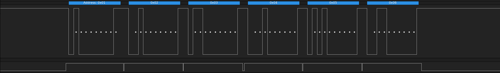

# SAMA5 9-bit Serial Mode

This repositories contains some examples to work with and evaluate 9-bit UART
solutions on Microchip SAMA5 processors.  Some processors support hardware 9-bit
mode and features surrounding this mode, and some do not.  However, even in
those cases it is still possible to make use of 9-bit mode.  In all cases, the
Linux kernel API does not provide a standard way of using all of the necessary
features.

## Building Examples

When cross compiling, put the compiler in your PATH or use an absolute path for
CC.

    CC=arm-linux-gcc make

This will generate several example binaries.

## SAMA5D2 (FLEXCOM) / SAMA5D3 9-bit Mode

**Usage Notes**

* Custom kernel patch must be applied to driver to support SENDA term bit.
* This method provides a way to use the SENDA bit of the UART (only available on
  FLEXCOM UART on SAMA5D2).
* The originl patches are available at:
  <https://www.spinics.net/lists/linux-serial/msg25997.html>
* Provides a method to use hardware driven RTS in RS485 mode on SAMA5D2.

**Example**

    ./senda_example /dev/ttyS2 20000

**Example Message**

Example message showing address set on first byte and tag-along RTS line while
transmitting.

## SAMA5D2 (Non FLEXCOM) 9-bit Support

**Usage Notes**

* Custom kernel patch must be applied to driver to support P9BIT term bit.
* Assume userspace has no control of parity.  The driver hijacks this bit.
* Must enable RS485 in term setup.  A side effect of RS485 mode is it requires
  the transmitter to be idle before the next byte is sent.
* Must disable DMA/PDC for UART port transfers in driver.
* It does not appear RTS is supported directly by the UART.

**Disable DMA in Device Tree**

To disable DMA for a specific port, this can be done in device tree.  Optionally,
DMA can be disabled for all ports in the kernel config.

    uart3: serial@fc008000 {
        /*atmel,use-dma-rx;*/
        /*atmel,use-dma-tx;*/
        pinctrl-names = "default";
        pinctrl-0 = <&pinctrl_uart3_default>;
        status = "okay";
    };

**Example**

    ./p9bit_example /dev/ttyS1 20000

**Example Messages**

Inter-byte delay is miniml and there is no difference between 9-bit high and
9-bit low bytes.  The following shows the 9th bit is set high on the first
message and following byts in the message have the 9th bit set low.

The minimum inter-message delay (not to be confused with inter-byte delay) is
around 22 milliseconds.  There is room to optimize this at the cost of more
custom interfaces.

## Global Userspace Solution

It is possible to essentually perform 9-bit emulation from userspace without any
kernel modification and this functionally works as expected on almost any UART
that supports parity.  However, do to the extra calls between the address byte
and the data byte, this can induce a long delay that may not be desirable.

**TX Address Byte**

    term.c_cflag = PARENB | CMSPAR| PARODD;
    tcsetattr(fd,  TCSADRAIN, &term);
    write(fd, buffer, 1);

**TX Data Bytes**

    term.c_cflag = PARENB | CMSPAR;
    tcsetattr(fd,  TCSADRAIN, &term);
    write(fd, buffer+1, size-1);

**RX**

    term.c_iflag = INPCK | PARMRK;
    tcsetattr(fd, TCSANOW, &term);
    ...
    read(fd, buffer, size);

**Example Messages**

There is about a 28 millisecond delay between the address byte and the data
bytes of the message.

