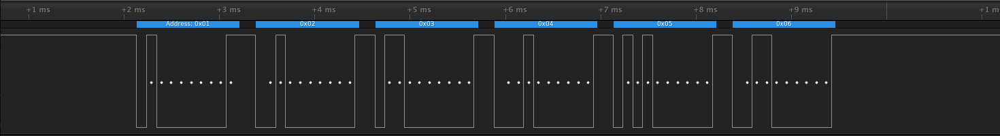
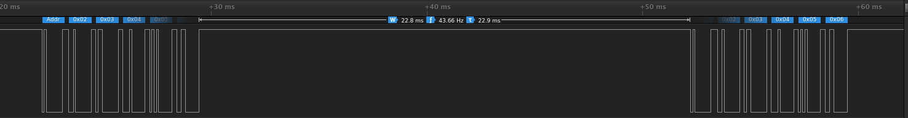

# SAMA5 9-bit Serial Mode

This repositories contains some examples to work with and evaluate 9-bit UART
solutions on Microchip SAMA5 processors.  Some processors support 9-bit mode and
features surrounding this mode, and some do not.  In all cases, the Linux kernel
API does not provide a standard way of using all of these features.

## SAMA5D2 9-bit Support

**Usage Notes**

* Custom patch must be applied to driver to support P9BIT term bit.
* Assume userspace has no control of parity.  The driver hijacks this bit.
* Must enable RS485 in term setup.  A side effect of RS485 mode is it requires
  the transmitter to be idle before the next byte is sent.
* Must disable DMA/PDC for UART port transfers in driver.

**Disable DMA in Device Tree**

To disable DMA for a specific port, this can be done in device tree.  Optionally,
DMA can be disabled for all ports in the kernel config.

    uart3: serial@fc008000 {
        /*atmel,use-dma-rx;*/
        /*atmel,use-dma-tx;*/
        pinctrl-names = "default";
        pinctrl-0 = <&pinctrl_uart3_default>;
        status = "okay";
    };

**Example Message**

Inter-byte delay is miniml and there is no difference between 9-bit high and
9-bit low bytes.  The following shows the 9th bit is set high on the first
message and following byts in the message have the 9th bit set low.

**Inter-Message Delay**

The minimum inter-message delay is around 22 milliseconds.  There is room to
optimize this at the cost of more custom interfaces.

## SAMA5D3 9-bit Mode

Several patches and the ensuing discussion was posted to LKML:

<https://www.spinics.net/lists/linux-serial/msg25997.html>

This patch is not evaluated.

## Global Userspace Solution

It is possible to essentually perform 9-bit emulation from userspace without any
kernel modification and this functionally works as expected.  However, do to the
extra calls inbetween bytes, it can introduce an inter-bytre delay that may not
be desirable.

**TX Address Byte**

    term.c_cflag = PARENB | CMSPAR| PARODD;
    tcsetattr(fd,  TCSADRAIN, &term);
    write(fd, buffer, 1);

**TX Data Bytes**

    term.c_cflag = PARENB | CMSPAR;
    tcsetattr(fd,  TCSADRAIN, &term);
    write(fd, buffer+1, size-1);

**RX**

    term.c_iflag = INPCK | PARMRK;
    tcsetattr(fd, TCSANOW, &term);
    ...
    read(fd, buffer, size);
